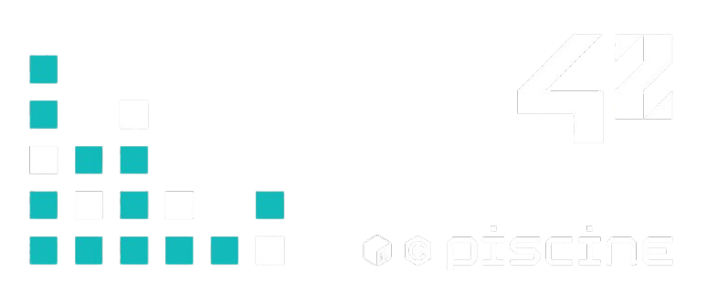

#  • Piscine

The Piscine (French for "swimming pool") is an intensive four-week selection process at 42, designed to immerse candidates in a unique learning environment.  
This rigorous program evaluates not only technical skills but also interpersonal abilities, as participants engage in peer-to-peer learning and collaborative projects.  
 
During the Piscine, candidates work on various programming modules, primarily in the C language, completing exercises that build upon each other. The atmosphere is dynamic and supportive, fostering friendships and teamwork among participants from diverse backgrounds. Weekly exams test the knowledge gained, while optional weekend projects, known as "rushes," further enhance collaborative skills. 
 
 
Overall, the Piscine serves as both a challenging introduction to programming and a critical assessment of candidates' motivation and adaptability, ultimately determining who will continue their journey at 42.
 
 

### Earned skills

  

  

###### Projeto desenvolvido por: <a href="https://github.com/AdaoG0n">Adão Gonçalves</a>

